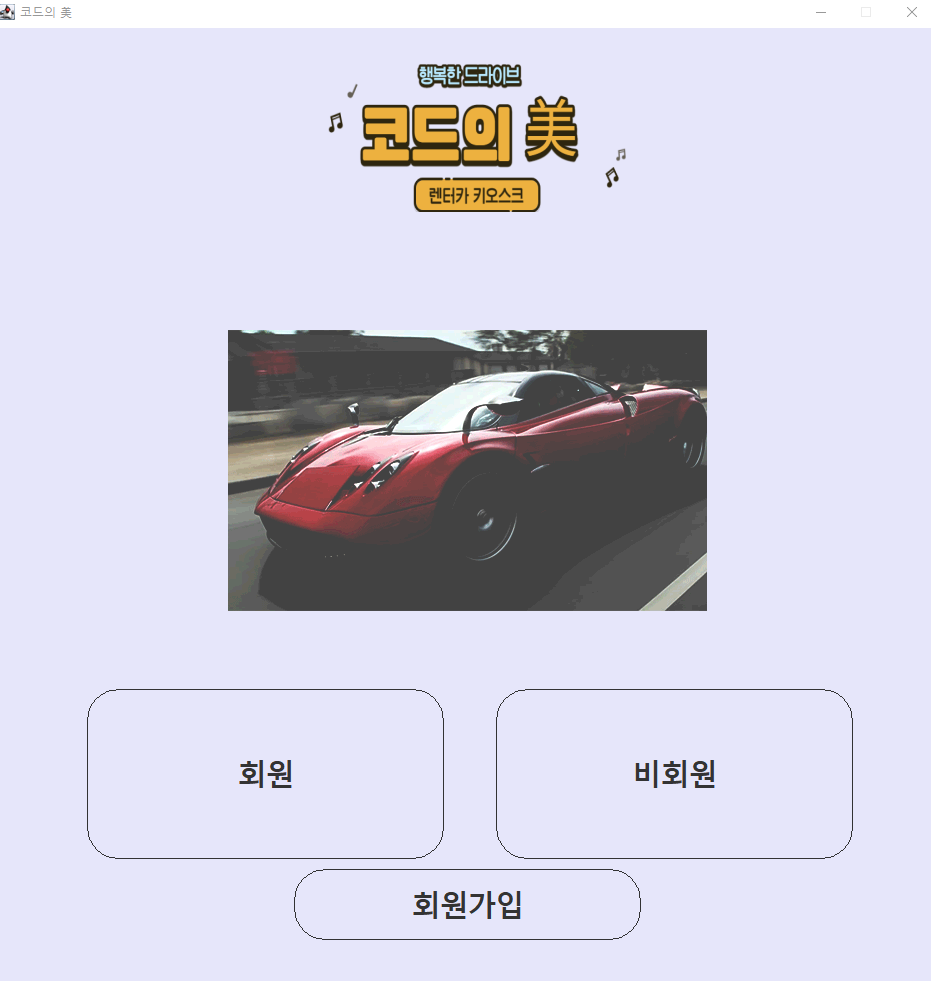
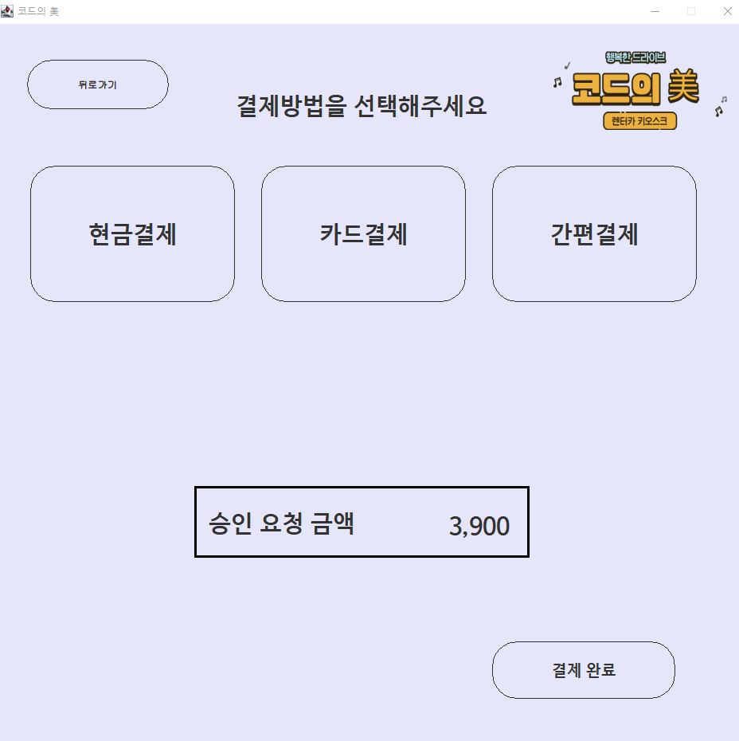

## 렌터카 키오스크
> 현재 카페, 패스트푸드, 스터디카페 등 많은 키오스크가 존재합니다.
> 하지만 여러 이유로 아직까지 렌터카 키오스크는 존재하지 않아 팀원들의 아이디어를 모아 렌터카 키오스크를 제작하였습니다.   
> **제작기간 30일, 팀원 3명**

 </img>

## Environment
**Java 1.8, Swing WindowBuilder, SpringBoot(2.3.1), SQLite(3.34.0), Gradle, thymeleaf**

## Files
* /capture : 구현 캡처 이미지
* /db : SQLite DB파일
* /img : 프로젝트 사용된 image파일
* /src : 프로젝트 source
* /table : 발표 시 사용할 쿼리문
* /기획단계_코드의美 : 기획단계 문서들

**실행시 필요 파일**
1. /db
2. /img
3. /src
4. build.gradle
5. settings.gradle

## 기능 설명
1. 회원가입
 * 아이디 중복체크
 * 비밀번호 검증
 * 전화번호 검증
2. 차량선택
   * 제조사, 차종 선택
   * 현재 이용 가능한 차량 수 표시
3. 차량 상세
   * 차량 상세 정보 표시
4. 이용 시간 선택
   * 10분, 1시간, 3시간, 6시간, 1일, 3일 단위로 시간 및 금액 계산
5. 결제 방법 선택
   * 현금, 카드, 간편결제 가능하나, 결제 시스템은 미구현.
6. 반납
   * 차량번호를 입력하여 반납
   * 반납시 초과 금액이 있을 경우 추가 결제 화면으로 이동.
7. 관리자 페이지 (Web)
   * 차량 등록 및 삭제
   * 대여 유무 확인

* 대여 및 반납 이후 5초후 처음 페이지로 이동.

## 실행 화면

</img>
</img>
</img>
</img>
</img>
</img>
</img>
</img>
</img>
</img>

